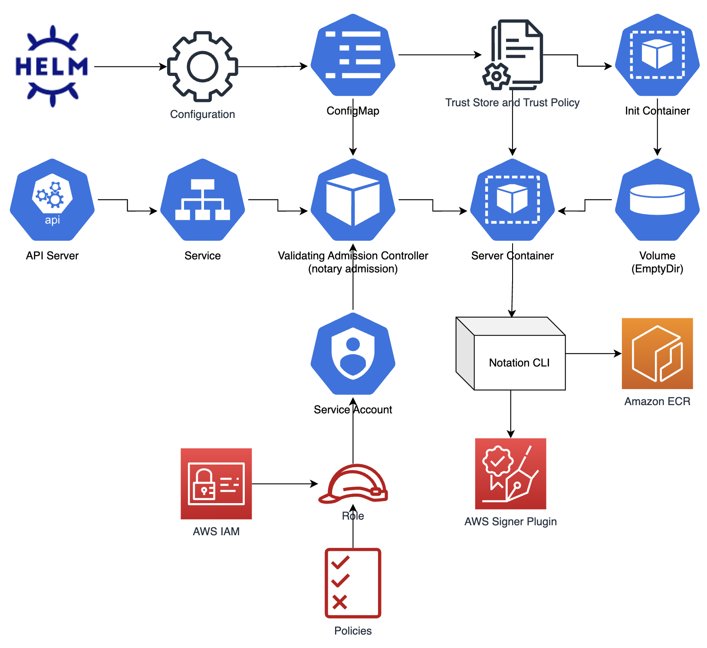

# K8s Notary Admission

> This solution is a non-production example, and is __NOT SUPPORTED FOR PRODUCTION USE__. It is tested to work in a single AWS account with multiple Amazon ECR regions. Cross-account access has not yet been explored.

This project is a non-production example of how to use the [Notation CLI](https://github.com/notaryproject/notation) with [AWS Signer](https://docs.aws.amazon.com/signer/latest/developerguide/Welcome.html) to verify container image signatures for container images stored in private Amazon ECR registries. This project uses a custom [Dynamic Admission Controller](https://kubernetes.io/docs/reference/access-authn-authz/extensible-admission-controllers/) to verify container images.

The approaches used in this project are inspired by the following OSS projects:
- [Go admission controller](https://github.com/douglasmakey/admissioncontroller)
- [Ratify](https://github.com/deislabs/ratify)

## Architecture


The solution centers around a custom controller that is written in Go and installed via Helm. The default configuration installs the Validating Webhook Configuration that will forward API server validation calls for all Pod _CREATE_ and _UPDATE_ operations, from any namespace not labeled with the `notary-admission-ignore=ignore` label.

> The current implementation of his solution only validates Pods, and does not act on workloads (Deployment, DaemonSet, etc.) that create pods. While this solution will prevent Pods from being created if their relevant images fail signature verification, it will not prevent the associated workload resources from being created. For example, a Deployment that results in failed validation of Pods, will still be created successfully. The Deployment status can be checked for failed Pods.

```
deployment.apps/test-bad created

kubectl -n admission-test get deployment test-bad -o=jsonpath='{.status}'
...
{"lastTransitionTime":"2023-02-16T23:56:47Z","lastUpdateTime":"2023-02-16T23:56:47Z","message":"admission webhook \"pods.notary-admission.aws.com\" denied the request: <ACCOUNT>.dkr.ecr.<REGION>.amazonaws.com/pause:3.9 image, in test-bad-649c9dfdb9-99nch pod, in admission-test namespace, failed signature validation","reason":"FailedCreate","status":"True","type":"ReplicaFailure"}],"observedGeneration":1,"unavailableReplicas":1}
...
```

## Operation
This example solution uses the Notation CLI to verify container image signatures of container images stored in Amazon ECR. This solution is compatible with the [OCI 1.0 Image Format Specification](https://github.com/opencontainers/image-spec). The Notation CLI uses an AWS Signer plugin to verify image signatures against signing keys and certificates, while simultaneously checking for revoked keys.

The container image built with this solution includes the following Notation and AWS Signer artifacts for operation:
- Notation CLI binary
- AWS Signer plugin binary
- AWS Signer root certificate (*.pem)

During the startup of this controller, the init container calls the Notation CLI to create the Notation [Trust Store](https://github.com/notaryproject/notaryproject/blob/main/specs/trust-store-trust-policy.md) needed for the verification process. An example Trust Store is seen below.

```bash
/verify
└── bin/notation # Notation binary not part of Notation Trust Store
└── notation
    ├── plugins
    │   └── com.amazonaws.signer.notation.plugin
    │       └── notation-com.amazonaws.signer.notation.plugin
    ├── trustpolicy.json
    └── truststore
        └── x509
            └── signingAuthority
                └── aws-signer-ts
                    └── signer-pre-prod-root.pem
```

The [Trust Policy](https://github.com/notaryproject/notaryproject/blob/main/specs/trust-store-trust-policy.md), seen in the above tree output, is configured via the `trustpolicy.json` file in the root of the `notary-admisson` Helm chart. It is created by the init container. An example of this Trust Policy is seen below.

```json
{
    "version": "1.0",
    "trustPolicies": [
        {
            "name": "aws-signer-tp",
            "registryScopes": [
                "*"
            ],
            "signatureVerification": {
                "level": "strict",
                "override": {}
            },
            "trustStores": [
                "signingAuthority:aws-signer-ts"
            ],
            "trustedIdentities": [
                "arn:aws:signer:<AWS_REGION>:<AWS_ACCOUNT_ID>:/signing-profiles/<PROFILE_NAME>"
            ]
        }
    ]
}
```

### AWS Signer Override

By default, AWS Signer will attempt a key/cert revocation check. To disable this revocation check, the following `signatureVerification` object can be configured in the trust policy JSON.

```json
"signatureVerification": {
    "level": "strict",
    "override": {
        "revocation": "skip"
    }
}
```

To log the revocation check without using it as a verification gate, the following `signatureVerification` object can be configured in the trust policy JSON.

```json
"signatureVerification": {
    "level": "strict",
    "override": {
        "revocation": "log"
    }
}
```

> The Notation Trust Policy and Trust Store locations are based on the [directory structure specifications](https://notaryproject.dev/docs/how-to/directory-structure/).

### Amazon ECR AuthN/AuthZ

K8s Notary Admission uses [IAM Roles for Service Accounts (IRSA)](https://docs.aws.amazon.com/eks/latest/userguide/iam-roles-for-service-accounts.html) and the [AWS SDK for Go v2](https://github.com/aws/aws-sdk-go-v2) to retrieve Amazon ECR auth tokens. These auth tokens contain the credentials (username and password) needed to perform reads (pulls) from Amazon ECR using the Notation CLI. By default, The AuthN/AuthZ process uses the AWS partition, region, and endpoint relative to the underlying Amazon EKS cluster. This can be overridden by supplying override values in the _charts/notary-admission/values.yaml_ file. 

It is important to understand that Amazon ECR credentials are region-specific. So, the K8s Notary Admission will need credentials for each Amazon ECR region, from where images will be verified. Amazon ECR credentials will be obtained and cached for 12 hours, if the credential cache is enabled in the Helm values file.

Additionally, K8s Notary Admission will pre-cache region specific Amazon ECR registries.

```yaml
ecr:
  auth:
    apiOverride:
      endpoint:
      partition:
      region:
    credentialCache:
      enabled: true
      preAuthRegistries: ["<AWS_ACCOUNT_ID>.dkr.ecr.<AWS_REGION>.amazonaws.com","<AWS_ACCOUNT_ID>.dkr.ecr.<AWS_REGION>.amazonaws.com"]
      cacheRefreshInterval: 300
      cacheTimeoutInterval: 600
```

> The Amazon ECR auth tokens are relative to the AWS account in which the Amazon EKS cluster is running, and the region in which the images are stored. Accessing Amazon ECR registries in remote accounts may require additional AWS IAM or Amazon ECR repository resource permissions.

The easiest way to add an IAM Service Account is to use the following [eksctl](https://eksctl.io/usage/iamserviceaccounts/?h=) command.

```bash
eksctl create iamserviceaccount \
    --name notary-admission \
    --namespace notary-admission \
    --cluster ${CLUSTER} \
    --attach-policy-arn arn:aws:iam::aws:policy/AmazonEC2ContainerRegistryReadOnly \
    --attach-policy-arn <AWS_SIGNER_POLICY_ARN> \
    --approve \
    --override-existing-serviceaccounts
```

> The Amazon EKS cluster must have an [OIDC provider](https://docs.aws.amazon.com/emr/latest/EMR-on-EKS-DevelopmentGuide/setting-up-enable-IAM.html) configured, in order to use IAM Roles for Service Accounts.

### AWS Signer AuthN/AuthZ

AWS Signer also uses credentials to make its calls to the AWS API. Those credentials come directly from the IRSA configuration of the Pod. The Service Account used by the Pod is annotated with an AWS IAM role with the appropriate AWS Signer permissions.

An example read-only AWS Signer policy is seen below:

```
{
    "Version": "2012-10-17",
    "Statement": [
        {
            "Sid": "SignerAccess",
            "Effect": "Allow",
            "Action": [
                "signer:ListProfilePermissions",
                "signer:GetSigningProfile",
                "signer:ListSigningJobs",
                "signer:ListSigningPlatforms",
                "signer:ListSigningProfiles",
                "signer:DescribeSigningJob",
                "signer:ListTagsForResource",
                "signer:GetSigningPlatform",
                "signer:GetRevocationStatus"
            ],
            "Resource": "*"
        }
    ]
}
```

> It is recommended that in a production environment, wildcards are not used in the _Resource_ element.

## Signing a Container Image in Amazon ECR with the Notation CLI

The following steps should be followed to sign a container image in Amazon ECR, using the Notation CLI and AWS Signer.

1. [Install the Notation CLI](https://notaryproject.dev/docs/installation/cli/)

2. Create an AWS Signer profile

```bash
aws signer put-signing-profile \
    --profile-name <SIGNING_PROFILE_NAME> \
    --platform-id Notary-v2-OCI-SHA384-ECDSA \
    --signature-validity-period 'value=12, type=MONTHS'
{
    "arn": "arn:aws:signer:<AWS_REGION>:<AWS_ACCOUNT_ID>:/signing-profiles/<SIGNING_PROFILE_NAME>",
    "profileVersion": "<VERSION>",
    "profileVersionArn": "arn:aws:signer:<AWS_REGION>:<AWS_ACCOUNT_ID>:/signing-profiles/<SIGNING_PROFILE_NAME>/<VERSION>"
}
```

3. Install AWS Signer plugin for Notation. On an M1 Mac the plugin is installed at:

```bash
/Users/<USER>/Library/Application Support/notation/plugins/com.amazonaws.signer.notation.plugin/notation-com.amazonaws.signer.notation.plugin
```

4. Add a signing key, referencing the AWS Signer profile (created above) and the AWS Signer plugin.

```bash
notation key add \
    --id arn:aws:signer:<AWS_REGION>:<AWS_ACCOUNT_ID>:/signing-profiles/<SIGNING_PROFILE_NAME> \
    --plugin com.amazonaws.signer.notation.plugin \
    <SIGNING_KEY_NAME>
<SIGNING_KEY_NAME>
```

5. Add the AWS Signer root PEM

```bash
notation certificate add --type signingAuthority --store aws-signer-ts signer-pre-prod-root.pem
```

6. Sign an existing Amazon ECR container image

```bash
notation sign \
    <AWS_ACCOUNT_ID>.dkr.ecr.<AWS_REGION>.amazonaws.com/<IMAGE_REPOSITORY>:<IMAGE_TAG> \
    --key <SIGNING_KEY_NAME> --signature-manifest image
```

6. Verify a signed image

```bash
notation verify \
    <AWS_ACCOUNT_ID>.dkr.ecr.<AWS_REGION>.amazonaws.com/<IMAGE_REPOSITORY>:<IMAGE_TAG>
```

## Getting started with Notary Admission in Amazon EKS

1. Build and push admission controller image. Modify _Makefile_ or pass arguments into _make_ command.

```bash
cd controller
make login
make build-init
make push-init
make build-server
make push-server
cd ..
```

2. Create TLS secrets (self-signed). These secrets will be used to serve TLS requests and allow the the Kubernetes API server to connect to the controller.

```bash
./scripts/gen-tls.sh
```

The controller TLS secrets are setup using the following server configuration.

```
[ req ]
prompt = no
req_extensions = v3_ext
distinguished_name = dn

[ dn ]
CN = notary-admission.notary-admission.svc

[ v3_ext ]
basicConstraints = CA:FALSE
keyUsage = nonRepudiation, digitalSignature, keyEncipherment
extendedKeyUsage = clientAuth, serverAuth
subjectAltName = DNS:notary-admission.notary-admission.svc,DNS:notary-admission.notary-admission.svc.cluster,DNS:notary-admission.notary-admission.svc.cluster.local
```

3. Update _charts/notary-admission/values.yaml_ with new controller image.

```
deployment:
  initImage: <INIT_IMAGE>
  serverImage: <SERVER_IMAGE>
...
```

4. Install with local Helm chart using the `./scripts/up.sh` script.

```bash
./scripts/up.sh

```

5. Test

Update Kubernetes test manifests with your images, then run the tests. 

```
./scripts/test.sh
./scripts/clean.sh
```

6. Uninstall

```bash
./scripts/down.sh
```

## Scale Testing
The purpose of scale testing was to ensure that Amazon EKS cluster operations were not negatively impacted by the K8s Notary Admission controller. The test was designed to validate 1000 pods, provisioned by a single Deployment. The execution time measured was the time between when the Deployment resource was applied to the cluster and when 1000 pods were scheduled.

The K8s Notary Admission controller was tested in an Amazon EKS v1.24 cluster, with controller replicas set to 1, 3, and 5. The cluster was setup to run across 3 AWS Availability Zones, using 2 managed nodegroups. 

The size of the nodes were chosen to accommodate the resource (CPU and Memory) requirements for 1, 3, and 5 controller replicas, as well as the 1000 test pods, provisioned via a separate Deployment. The webhook failurePolicy was set to `Fail`, to ensure that no pods were created without successful validation.

During testing, the K8s Notary Admission controller logs were monitored, in debug mode, as well as the test Deployment status field.

### Test Results
The tests were setup to validate 1000 pods. As a point of reference, without validation, the 1000 pods took approximately _50 seconds_ to schedule.

#### 1 Replica

- CPU settings: 1.0
- Memory settings: 1024mi
- Time to validate 1000 pods: 2mins/1sec 
- Peak CPU: 0.45
- Peak Memory: 650MiB

> During execution, there were numerous webhook timeout errors reported in the Deployment status field. This meant that the replica controller had to retry those pods until validation succeeded. This resulted in a longer execution time. Those timeout errors were not observed in the 3 and 5 replica tests.

#### 3 Replicas

- CPU settings: 0.5
- Memory settings: 512mi
- Time to validate 1000 pods: 54.68sec 
- Average Peak CPU: 0.138
- Average Peak Memory: 44.2KiB

#### 5 Replicas

- CPU settings: 0.5
- Memory settings: 512mi
- Time to validate 1000 pods: 54.03sec 
- Average Peak CPU: 0.08
- Average Peak Memory: 31.06MiB

#### Test Summary

The test results indicated that with at least 3 replicas there was no appreciable negative impact to the Amazon EKS cluster operations. However, with 1 replica and increased resources, all pods were validated, but at twice the normal operation time. For this reason, running with 1 controller replica is NOT recommended in clusters that experience high rates on change.

Additional tests of the controller, with 1 replica and resource settings reduced to those for multiple replicas, resulted in severe impact to cluster operations. This was caused by multiple controller pod restarts, attributed to OOM issues. So, it is recommended that the K8s Notary Admission controller be operated with at least 3 replicas, with at least the resource requests and limits defined in the above testing, if like workloads are to be tested in cluster with a high rate of change.

> Again, the K8s Notary Admission controller is provided as a non-production example and is __NOT SUPPORTED FOR PRODUCTION USE__.


## Security

See [CONTRIBUTING](CONTRIBUTING.md#security-issue-notifications) for more information.

## License

This library is licensed under the MIT-0 License. See the LICENSE file.

